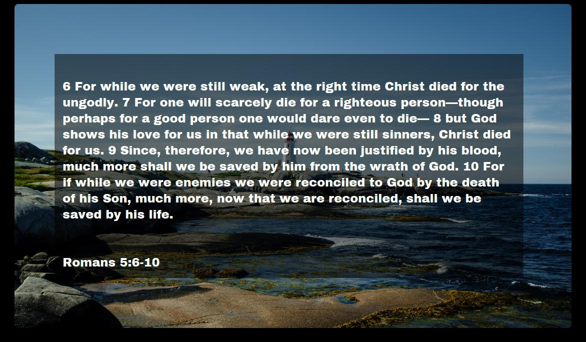

# Enlighting: A Quote Image Renderer



This program converts a list of CSV quotes and a folder of image groups into an image with the quotes rendered on the image. Useful for mass producing quotes powerpoints.
Each individual image can be fine-tuned via `html/css`.

The project was written roughly in a span of a weekend's worth of work. As a result, the codebase is suboptimal.
There are some optimizations that can still be done. See [Extended Project Goals](#Extended-Goals) sections for more details.

There are no commandline options for modifying images properties. Direct modification of a CSS file is required.

## Setup

> pip install -r requirements.txt

Makesure to have `wkhtmltopdf` installed and available inside your `PATH` variable.
Binaries and more instructions can be found at [wkhtmltopdf.org](https://wkhtmltopdf.org/).

### Platform Support

Tested on Windows 10 and should work on any platform that supports Python and [wkhtmltopdf](https://wkhtmltopdf.org/).

## How to Use

Supply a handful of `.png` or `.jpg` images into the `images` folder inside the program root.
Provide a `input.csv` file where there is atleast two columns: one for the name of the person who spoke the quote and the quote itself. Then run:

> python enlighten.py

The program will then *randomly* match a quote and a background. The output product can be found under `img_post`.

Specifically, the program will then generate a `blurred` folder for images compiled with a blur effect and then a bunch of html will generate inside `render_html`. Two new
folders `img_render` and `img_post` will appear. `img_render` is the raw `jpgs` pre-processed and `img_post` is the final image product.

See `python enlighten.py --help` for more info and changing folder names.

### Modifying Quote-Image Template

Users can choose to modify general quote-image settings inside the template file: `templates/template.html`. You can modify
the grid size, the padding of the text, font-family, etc. Modifying this file will modify all images generated. Please note that the fonts supported
is the same as what is installed inside the host's OS.

To fine-tune each image, users must setup their environment to run each stage of the program separately. See [advanced individual stage run setup](#Advanced-Running-Each-Stage-Individually).

### Fine-Tuning Background Image Constraints

Since each image provided can have various resolutions and image ratios, users can opt to provide constraints when pairing
quotes and their images.

After the first stage of the program, a `properties.json` will be generated which will contain properties for each image placed inside
`images`. `properties.json` contains all configurations related to a given image.

It will look something like:

```json
"0fbe384c9c": {
   "filename": "my_custom_background.img"
}
```

Users can then specify certain image constraints via the `css` tag:
```json
"0fbe384c9c": {
   "filename": "my_custom_background.img",
   "css": [
        "min-height:70em;",
        "max-height:80em;"
   ]
}
```

In doing so, any attributes listed will then be copied as a valid `css` in the `html` render which will subsequently affect the image.
Furthermore, if using `min-height` and/or `max-height` *and* using the `em` measurements, the `render_html` will automatically attempt to pair
only quotes that fit inside the given constraints. This allows for users to prevent long quotes from appearing on small images
or short quotes on large images. This automated process is not perfect, however, and should be taken with a grain of salt. Fine-tuning of images
may be necssary.


Once `properties.json` has been modified, users will have to re-run `python enlighten.py` to use the new settings.
`properties.json` should persisten across program sessions so long as no images are *removed* from the images folder.
Adding new images does not required deleting `properties.json`.

## Advanced: Running Each Stage Individually

Users can opt to fine-tune each specific image generated if they opt to run each stage used by `enlighten.py`.

The program is split into three stages:

1. Rendering of HTML files (`render_html.py`)
2. Rendering of JPG files (`convert.py`)
3. Post-processing of JPG files (`post_process.py`)

The recommended way of using the program is to run `enlighten.py` which is a thin wrapper around all three stages. However
each file corresponding to each stage can be ran by itself. `cwd` and other settings, however, will have to be reconfigured to
use these scripts directly. Instead, it is best advised to write a wrapper like `enlighten.py` which calls the functions in each file as to 
have the proper working directory. Refer to each python file for more information on how each file works.

### Fine-Tuning Each Output Image

To be able to:

* Modify each image-quote individually
  * Includes: font, font-size, color, scale, etc.
* Modify each image-quote's background

Users will have to run each stage individually (see [parent section](#Advanced-Running-Each-Stage-Individually)).
After running `render_html.py`, a `render_html` folder will contain all raw `html` files that encode the final output image.
Users can then open up each file individually and modify the `css` file. During this time, users can also modify the background
image URL to change another image.

Once all the necessary changes have been completed, the user should then run `convert.py` and `post_process.py` to convert the
`html` files into `jpgs`.

## Extended Goals

- Optimize smarter image selection, right now we randomly sample images until a image with height constraints matches the text.
- Better usage of `images` and `blurred` directories. Right now they are just copied into the `render_html` folder everytime.
- Use commandline options instead of modifying variables.