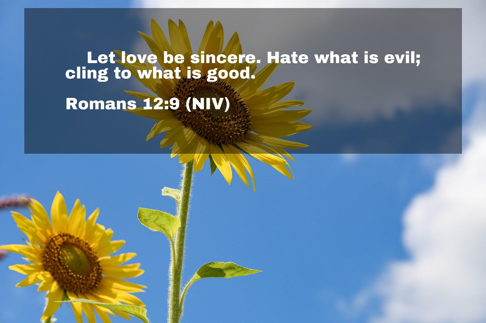

# Enlighting V2: A AI Powered Quote Image Renderer

Need to generate inspirational quotes in bulk and don't want to tinker with font sizes every image source but have a preference on where to place a quote?

Enlighten can generate a few templated options and is smart enough to auto-scale font according to your file source.
No more long hours of fine tuning images. Just pick a style, an image, and bulk generate!

## Usage

Define an input CSV file which generates the desired values.

```bash
python enlighten.py -i input.csv
```

Which will generate images inside the `output/` by default. An example image looks like the following:


## CSV File Format

- `image_name`: name of the image file found in `--image-fpath`.
  - Can be empty to select random image in folder.
- `quote_source`: name of the quote source.
- `quote`: the quote itself.
- `style`: Per image style. `--render-style auto` must be enabled for this column to work.

An example CSV file has been placed in the project folder.

## Fine Tuning

There are a few parameters exposed to make some batch fine-tuning.

* `--tab-width` sets the default tab width for each quote. Set to 0 for no tabs.
* `--font-size` the default max size font. This is only a suggestiong.
* `--render-style` render a specific type of style.

For more options, see `--help` to see up-to-date.

Have or desire a parameter? Consider filing an issue and let's discuss!

## Image Styles

There are currently three different supported image styles: full, top, and bottom.
You can specify via the `-r` flag. See `--help` for more info.

### Full Style


### Top Style



### Bottom Style


## Contribution

All new features submitted must have their code-path exercised in `tests/`.
